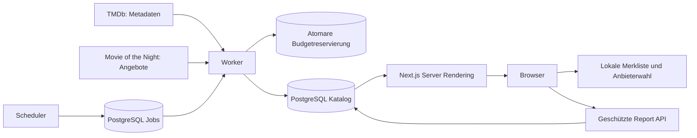

# Architektur

## Datenfluss

Stable Next.js 16.3.4/React 19 ist der Node-Produktionspfad. Vinext/Vite liefert einen Cloudflare-Worker für die private Sites-Veröffentlichung desselben Quellcodes. Die Kompatibilitätsschicht wird separat gebaut. PostgreSQL bleibt in beiden Fällen die Datenquelle: `pg` auf Node, Neon HTTP auf Sites; dort läuft kein TCP-Pool und kein dauerhaft laufender Hintergrundprozess.

## Modelle und Integrität

Titel sind mit `movie:<tmdb-id>` beziehungsweise `tv:<tmdb-id>` identifiziert. Fünf Lokalisierungen, frühere Slugs, Staffeln und Episoden sind getrennt modelliert. Metadaten führen Quelle und Inhaltsrevision. Redaktionelle Beschreibungen werden auch im denormalisierten Dokument beim Reimport bewahrt.

Ein Angebot hat Titel, Markt, Anbieter, optionales Zusatzabo, Angebotsart, Qualität, Dezimalpreis als Zeichenfolge, Währung, Bezugseinheit, belegte Staffel-/Episodennummern, Audios/Untertitel, Quelllink und Zeitstempel. Preisvergleiche berücksichtigen alle Bezugsdimensionen. Unbekannte Qualität oder unnummerierte Staffel-/Episodenpreise erhalten keine Bestpreisbehauptung.

Snapshots unterscheiden Verfügbarkeit (`available`, `empty`, `unsupported`, `unchecked`, `error`) und Frische (`fresh`, `overdue`, `stale`, `unknown`). Fehler aktualisieren den letzten Versuch und lassen zuletzt bekannte Angebote bestehen. Abgelaufene Angebote werden beim Lesen ausgefiltert. Erfolgreiche, vollständige Antworten können Löschungen erzeugen; Teilantworten niemals. Größere unerwartete Mengenabfälle werden quarantänisiert.

Jobs verwenden eindeutige Deduplizierungsschlüssel, `FOR UPDATE SKIP LOCKED`, zwei Minuten Lease, 30 Sekunden Heartbeat und begrenzte Wiederholungen. Datenbankfunktionen prüfen die Lease beim Speichern von Titeln und Angebotssnapshots. Ein verdrängter Worker darf keinen neueren Stand überschreiben. Tages-/Monatsbudget wird vor jedem externen Request unter einer Transaktionssperre reserviert. Fehlgeschlagene Requests werden konservativ nicht erstattet.

## Cache und Suchgrenzen

Öffentliche Katalogresultate: bounded Prozesscache mit maximal 500 Einträgen, 30 Sekunden frisch und maximal 120 Sekunden zusätzlicher Stale-Nutzung bei Neuabruf. Schlüssel umfassen Sprache, Markt, Filter und Seite. Gleichzeitige identische Requests werden zusammengefasst. Nach Prozesswechsel ist der Cache leer; es ist kein globaler Redis-Cache. Persönliche `mine`-Filter und Merkliste durchlaufen diesen Cache nicht.

Katalogkarten lesen Metadaten und aggregierte Angebote mit einer SQL-Abfrage, nicht mit API-Aufrufen pro Karte. Die Suche arbeitet zunächst im eigenen Index mit Volltext, Akzentnormalisierung, Trigrammen, Originaltitel und vorhandenen Übersetzungen. Eine explizite Nachsuche kann einen budgetierten Importjob anlegen. Grenzwerte: 120 Suchzeichen, 24 Resultate pro Seite, 100 lokale Merkeinträge. Anbieterzusatzabos sind unabhängig auswählbar.

## Privatsphäre und Grenzen

Kein Nutzerkonto, kein Tracking und keine E-Mail-Übermittlung. Merkeinträge und Anbieterwahl werden im Browser gespeichert. Reports werden nur nach erfolgreichem Datenbankinsert als gesendet bestätigt und nach 90 Tagen gelöscht. Private APIs setzen `private, no-store`, prüfen Origin, Eingaben und Rate Limits. Admin-Sitzungen sind zeitlich begrenzte HMAC-Cookies, HttpOnly und SameSite.

Live-Verfügbarkeit, echte Tarifgewichte, Datenbank-Latenz und verteilte Mehrprozesslast sind ohne reale Infrastruktur noch nicht nachgewiesen. PostgreSQL-WASM-Tests validieren SQL und Wiederherstellung, ersetzen aber keine Produktionslastmessung.
